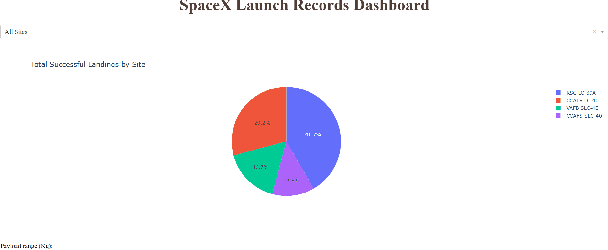

# SpaceX Falcon 9 First Stage Landing Prediction
 

## 🚀 Project Overview
This project predicts the success of SpaceX Falcon 9 first-stage landings. Since SpaceX reuses these stages, a successful landing saves roughly **$60 million** per launch. This repository represents the cumulative capstone project for the **IBM Data Science Professional Certificate**.

## 📊 Key Features
* **Data Collection:** Automated data retrieval using SpaceX API and Wikipedia web scraping.
* **Interactive Dashboard:** Developed a comprehensive **Dash** application with **Plotly** to visualize launch site success rates and payload weight correlations.
* **Geospatial Mapping:** Utilized **Folium** to create interactive maps pinpointing launch sites and calculating distances to logistical hubs.
* **Predictive Modeling:** Built, tuned, and compared Logistic Regression, SVM, Decision Tree, and KNN models.

## 🛠️ Tech Stack

## 📈 Methodology
### 1. Data Processing & SQL
* Cleaned API responses and scraped HTML tables.
* Used **SQL** via sqlite3` to perform complex queries on launch data to identify patterns in successful landings.

### 2. Interactive Visualization (Dash)
The Dash app includes:
* **Dropdown Menu:** Select "All Sites" or a specific launch site.
* **Pie Chart:** Visualize the total successful launches for a chosen site.
* **Range Slider:** Filter results by Payload Mass (kg) to see how weight affects landing probability via a scatter plot.

### 3. Machine Learning Results
All models were optimized using `GridSearchCV`.

| Model | Accuracy Score |
| :--- | :--- |
| **Decision Tree** | 88.88% |
| **Support Vector Machine** | 83.33% |
| **KNN** | 83.33% |
| **Logistic Regression** | 83.33% |

## 📁 Repository Structure
* `notebooks/`: Jupyter notebooks covering API, Scraping, EDA, SQL, and Folium maps.
* `spacex_dash_app.py`: The Python script for the Plotly Dash dashboard.
* `demo.gif`: A recording of the Dash app's interactive features.
* `requirements.txt`: List of dependencies including `dash` and `pandas`.

## ✍️ Author
**Rossini Martyr** [https://www.linkedin.com/in/rossinimartyr/]
